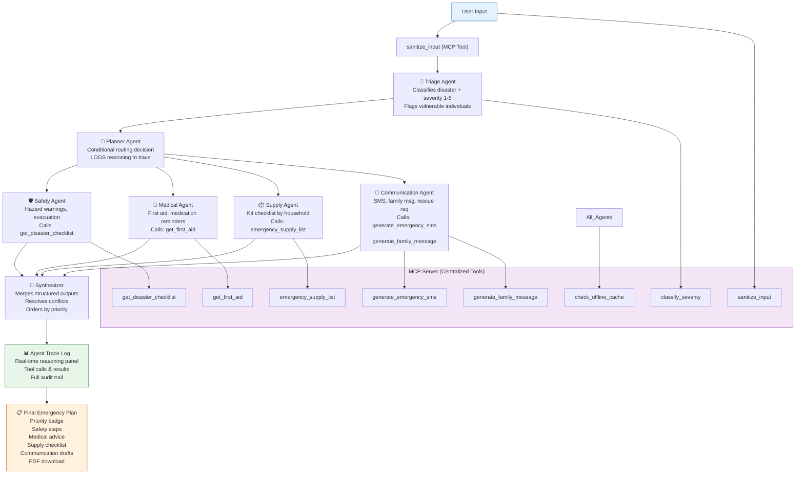

# 🆘 ResQ AI — Multi-Agent Disaster Response & Emergency Assistant

**Track:** Agents for Good — Kaggle AI Agents: Intensive Vibe Coding Competition

When disaster strikes, ResQ AI's team of specialist AI agents triages, plans, and coordinates a personalised emergency response in seconds — and shows you exactly how they reasoned to get there.

---

## ✨ Features

- **🧠 Multi-Agent Reasoning Pipeline** — Six specialist agents (Triage, Planner, Safety, Medical, Supply, Communication) coordinate via a Planner that conditionally delegates based on severity and household profile.
- **🔍 Live Agent Trace** — Watch every agent activate in real time: their reasoning, tool calls, and results. The demo experience *is* the architecture — no black boxes, no spinners.
- **🛡️ Demoable Security** — Prompt-injection sanitisation is a first-class MCP tool called *before* any agent runs. A dedicated Security Test Mode lets judges fire preloaded attack examples and see the defence live.
- **📡 Offline Resilience** — An `check_offline_cache` tool provides fallback data when the Gemini API is unreachable, with explicit `source` tagging so the trace shows cache vs. live origin.
- **📋 Structured Outputs** — Every agent produces typed, schema-validated Pydantic outputs that the Synthesizer merges deterministically — no free-text parsing.
- **📄 PDF Report** — Download a formatted emergency plan as PDF (fpdf2) with priority badge, safety steps, medical advice, supply checklist, and communication drafts.
- **📱 Tap-to-Copy** — Communication drafts displayed in copy-ready code blocks.
- **🔒 Security-First** — Input sanitisation gate, rate limiting (per-hour), in-memory-only state (no persistent storage), env-only secrets, persistent medical/emergency disclaimers.

---

## 🏗️ Architecture



### Conditional Routing Logic

| Trigger | Routes To |
|---|---|
| Severity ≤ 2 + no hazards | Safety only |
| Severity ≥ 4 OR fire/chemical hazards | All 4 specialist agents |
| No children/elderly/pets | Supply skips child/elderly/pet items |
| No medical conditions | Medical runs with default first-aid only |
| `sanitize_input` flags injection | Pipeline aborted with warning |

---

## 🗂️ Project Structure

```
resq-ai/
├── agents/                    # ADK Agent definitions
│   ├── triage_agent.py        # Severity + hazard classification
│   ├── planner_agent.py       # Conditional routing decisions
│   ├── safety_agent.py        # Safety checklists
│   ├── medical_agent.py       # First aid guidance
│   ├── supply_agent.py        # Emergency supply lists
│   ├── communication_agent.py # SMS + family message drafts
│   ├── synthesizer.py         # Final plan merger
│   └── pipeline.py            # Orchestrator with trace capture
├── mcp/                       # MCP Server
│   ├── server.py              # Tool registry + caller
│   └── tool_schemas.py        # Pydantic I/O schemas
├── tools/                     # Tool implementations
│   ├── severity.py            # classify_severity
│   ├── checklist.py           # get_disaster_checklist
│   ├── first_aid.py           # get_first_aid
│   ├── supplies.py            # emergency_supply_list
│   ├── messaging.py           # generate_emergency_sms / family_message
│   ├── security.py            # sanitize_input
│   └── offline_cache.py       # check_offline_cache
├── frontend/                  # Streamlit UI screens
│   ├── landing.py             # Project pitch + start
│   ├── form.py                # Emergency intake form
│   ├── trace_view.py          # Live agent trace timeline
│   ├── results.py             # Final plan display
│   └── security_demo.py       # Interactive injection test console
├── utils/                     # Shared utilities
│   ├── state.py               # Session state management
│   ├── pdf_export.py          # PDF report generation
│   └── validators.py          # Form validation + rate limiting
├── config/
│   └── settings.py            # Env-var configuration
├── assets/                    # Static assets (icons, images)
├── .env.example               # Environment template
├── app.py                     # Streamlit entry point
├── requirements.txt           # Python dependencies
└── README.md                  # This file
```

---

## 🚀 Installation

### Prerequisites

- Python 3.11+
- A Google Gemini API key ([get one here](https://aistudio.google.com/app/apikey))

### Local Setup

```bash
# Clone the repository
git clone https://github.com/yourusername/resq-ai.git
cd resq-ai

# Create and activate a virtual environment (recommended)
python -m venv venv
# Windows
venv\Scripts\activate
# macOS/Linux
source venv/bin/activate

# Install dependencies
pip install -r requirements.txt

# Configure environment
cp .env.example .env
# Edit .env and set your GEMINI_API_KEY
```

### Run Locally

```bash
streamlit run app.py
```

Open http://localhost:8501 in your browser.

---

## ☁️ Deployment

### Streamlit Community Cloud

1. Push the repository to GitHub.
2. Go to [share.streamlit.io](https://share.streamlit.io) and click **Deploy an app**.
3. Select the repo, branch, and set `Main file path` to `app.py`.
4. Add your `GEMINI_API_KEY` as a [Streamlit secret](https://docs.streamlit.io/deploy/streamlit-community-cloud/deploy-your-app/secrets-management):
   ```toml
   # .streamlit/secrets.toml
   GEMINI_API_KEY = "your-key-here"
   ```
5. Click **Deploy**.

### Hugging Face Spaces

1. Create a new Space at [huggingface.co/spaces](https://huggingface.co/spaces).
2. Choose **Streamlit** as the SDK.
3. Clone the Space and push the code:
   ```bash
   git clone https://huggingface.co/spaces/yourusername/resq-ai
   cd resq-ai
   # Copy all project files here
   git add .
   git commit -m "Initial commit"
   git push
   ```
4. Add your `GEMINI_API_KEY` in the Space's **Settings → Repository Secrets**.
5. The Space auto-deploys on push.

---

## 🖼️ Screenshots

<!--
Add screenshots here after deploying:

| Screen | Description |
|---|---|
|  | Project pitch and Start button |
|  | Emergency intake form with Security Test Mode toggle |
|  | Live prompt-injection test console |
|  | Real-time multi-agent reasoning timeline |
|  | Prioritised emergency action plan |
-->

*Screenshots coming soon. Replace these placeholders with actual captures after deployment.*

---

## 🔮 Future Improvements

- **Multi-language support** — Accept input and generate plans in multiple languages.
- **Real-time weather/seismic API integration** — Pull live hazard data for more accurate severity classification.
- **Map integration** — Show evacuation routes and nearby shelters on an embedded map.
- **Voice input** — Speech-to-text for hands-free emergency reporting.
- **Mobile app** — Standalone mobile build with push notification support.
- **Persistent user profiles** — Optional saved profiles for faster form filling (opt-in only).
- **Advanced evaluation** — ADK eval framework datasets for measuring plan quality across scenarios.
- **A2A protocol** — Interoperability with other emergency response systems via Google's Agent-to-Agent protocol.

---

## 📄 License

MIT License — see [LICENSE](LICENSE) for details.

---

Built with [Google ADK](https://adk.dev), [Streamlit](https://streamlit.io), and [Gemini](https://deepmind.google/technologies/gemini/) for the Kaggle AI Agents: Intensive Vibe Coding Competition.
