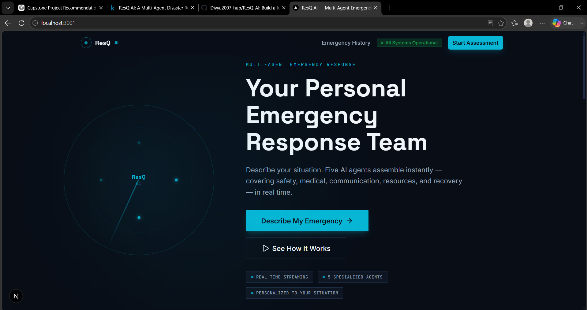
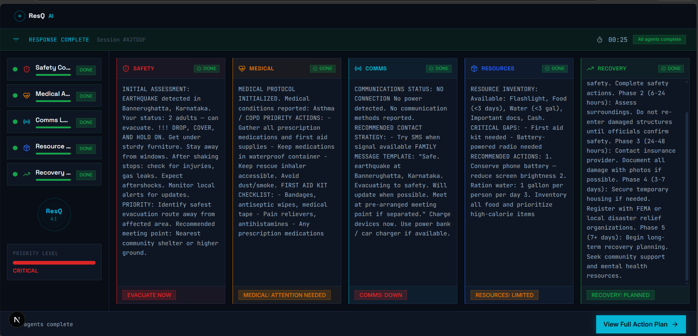
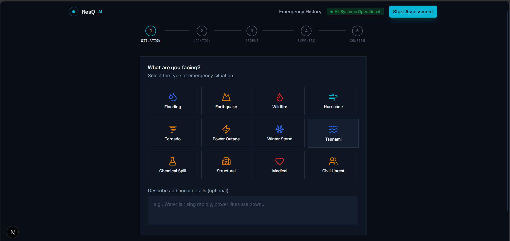
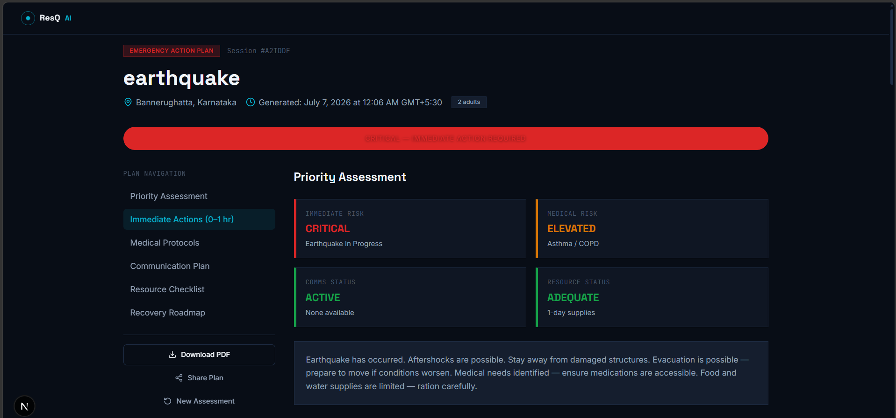
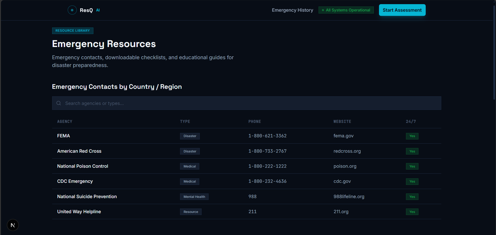
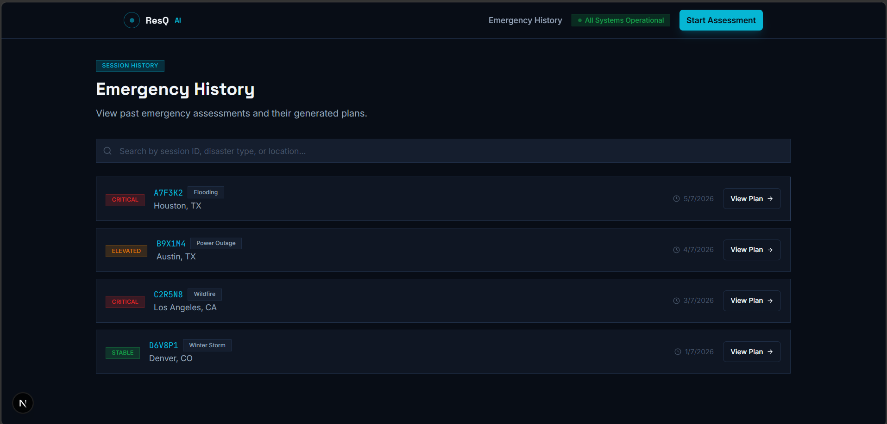

# 🆘 ResQ AI — Multi-Agent Disaster Response & Emergency Assistant

**Track:** Agents for Good — Kaggle AI Agents: Intensive Vibe Coding Competition

When disaster strikes, ResQ AI's team of specialist AI agents triages, plans, and coordinates a personalised emergency response in seconds.



---

## ✨ Features

- **🧠 5 Specialist AI Personas** — Safety, Medical, Communications, Resources & Supply, and Recovery agents analyse your situation and generate coordinated output in real time.
- **🔍 Live Streaming** — Watch each agent's reasoning appear character-by-character as they process your assessment.
- **📋 5-Step Assessment Wizard** — Guided intake with geolocation, disaster type selection (12 types), household details, medical conditions, utilities status, and supplies inventory.
- **📝 Dynamic Action Plan** — Priority-adjusted plan with immediate actions, medical protocols, communication templates, resource checklist, and recovery roadmap — all generated from your specific assessment.
- **📡 Offline Resilience** — Offline Backup card with Google Maps embed (or SVG fallback) and "Navigate to Shelter" button using real coordinates.
- **📱 Print & Share** — Print-ready action plan with `window.print()` support.
- **🎯 Scroll-Synced Navigation** — Sidebar tracks your position through the action plan sections.
- **🎉 Celebration on Completion** — Confetti animation when all agents finish.

---

## 🏗️ Architecture



```
User Assessment ──► /api/agent-response ──► Gemini 2.0 Flash ──► 5 Agent Briefings
                                                │
                                          Fallback Templates
                                          (if API unreachable)
```

Each agent receives a role-specific system prompt with the full assessment context. The API route runs on the server — your API key never reaches the client.

### 5 Agent Roles

| Agent | Role |
|---|---|
| **Safety** | Disaster-specific first action, evacuation/shelter decision, hazard warnings |
| **Medical** | Condition-specific protocols, medication management, first aid checklist |
| **Communications** | Connectivity assessment, SMS-first strategy, family message template |
| **Resources & Supply** | Inventory audit, critical gap identification, rationing advice |
| **Recovery** | 5-phase recovery roadmap from 0 hours to 7+ days |

---

## 🗂️ Project Structure

```
resq-ai/
├── next-app/                    # Next.js application
│   ├── src/
│   │   ├── app/
│   │   │   ├── page.tsx                    # Landing page
│   │   │   ├── assess/page.tsx             # 5-step assessment wizard
│   │   │   ├── response/[sessionId]/
│   │   │   │   ├── page.tsx                # Live agent streaming
│   │   │   │   └── plan/page.tsx           # Dynamic action plan
│   │   │   ├── resources/page.tsx          # Emergency contacts & guides
│   │   │   ├── history/page.tsx            # Past sessions
│   │   │   └── api/agent-response/route.ts # Gemini API + fallback
│   │   ├── components/
│   │   │   ├── agents/          # Agent cards, sidebar, status indicators
│   │   │   ├── assessment/      # Disaster type grid, step wizard
│   │   │   ├── plan/            # Priority bar, resource checklist
│   │   │   ├── common/          # Severity badge, inline alert
│   │   │   ├── layout/          # Navbar, footer
│   │   │   ├── radar/           # CSS/SVG radar ping animation
│   │   │   └── ui/              # shadcn/ui primitives
│   │   ├── lib/
│   │   │   ├── store.ts         # Zustand state management
│   │   │   ├── types.ts         # TypeScript interfaces
│   │   │   └── utils.ts         # Helpers (cn, formatTime, etc.)
│   │   └── globals.css          # Design system (colors, fonts, animations)
│   ├── .env.local               # GEMINI_API_KEY
│   ├── next.config.ts
│   ├── tailwind.config.ts
│   ├── package.json
│   └── vercel.json
├── config/
│   └── settings.py              # Python backend config
├── screenshots/                 # App screenshots
├── vercel.json                  # Vercel deployment config
└── README.md                    # This file
```

---

## 🖼️ Screenshots

| Screen | Description |
|---|---|
|  | Hero with radar animation, 3-step guide, 5 agent tags, CTA |
|  | Disaster type selection grid (12 types) |
|  | 5 agents streaming in real time with status indicators |
|  | Dynamic plan with priority bar, all sections, scroll nav |
|  | Emergency contacts, downloadable checklists, disaster guides |
|  | Session list with search and priority filters |

---

## 🚀 Installation

### Prerequisites

- Node.js 18+
- A Google Gemini API key ([get one here](https://aistudio.google.com/app/apikey))

### Local Setup

```bash
# Navigate to the Next.js app
cd next-app

# Install dependencies
npm install

# Configure environment
cp .env.local.example .env.local
# Edit .env.local and set your GEMINI_API_KEY

# Run development server
npm run dev
```

Open http://localhost:3000 in your browser.

### Build for Production

```bash
npm run build
npm start
```

---

## ☁️ Deployment

### Vercel

[](https://vercel.com/new/clone?repository-url=https://github.com/Divya2007-hub/ResQ-AI)

The `vercel.json` at the repo root sets the project to use `next-app/` as the root directory:

```json
{
  "rootDirectory": "next-app",
  "framework": "nextjs"
}
```

Add `GEMINI_API_KEY` as an environment variable in the Vercel dashboard.

---

## 🔮 Future Improvements

- **Google ADK Multi-Agent Pipeline** — Replace direct Gemini calls with a proper ADK agent orchestration pipeline with conditional routing.
- **MCP Tool Server** — Register disaster-response tools (first aid, checklists, SMS, sanitization) as MCP tools for agent use.
- **Security Layer** — Input sanitization, rate limiting, prompt-injection detection.
- **Database Persistence** — Save sessions to a database so history survives page refresh.
- **PDF Export** — Server-side PDF generation of the action plan.
- **Real-time Hazard Data** — Integrate weather/seismic APIs for live hazard assessment.

---

## 📄 License

MIT License — see [LICENSE](LICENSE) for details.

---

Built with [Next.js](https://nextjs.org), [Tailwind CSS](https://tailwindcss.com), [Gemini](https://deepmind.google/technologies/gemini/), and [Framer Motion](https://framer.com/motion) for the Kaggle AI Agents: Intensive Vibe Coding Competition.
